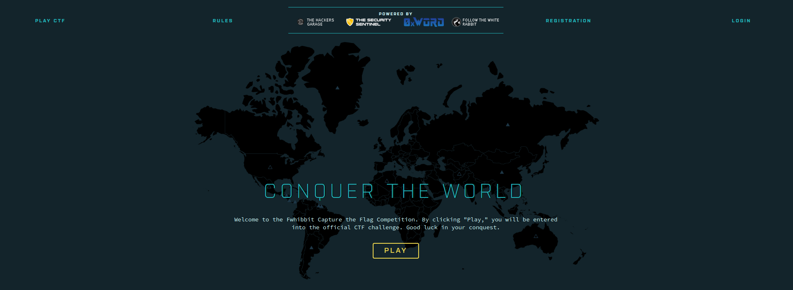
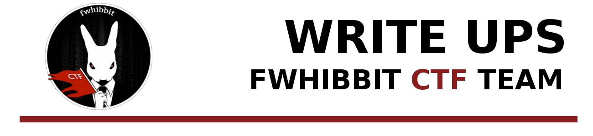
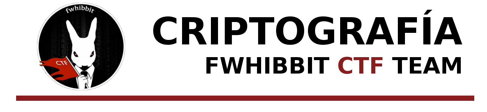

# [CTF_FWHBBIT](https://ctf.followthewhiterabbit.es/)

## [FWHIBBIT](http://fwhibbit.github.io/) - [Blog](https://fwhibbit.es/)

[FWHIBBIT](http://fwhibbit.github.io/) es un grupo formado por una serie de amigos que estudian y trabajan sobre nuevas ideas en el ámbito de la ciberseguridad. Puedes seguir nuestro [blog](https://fwhibbit.es/) para más información.

# Captura la bandera - Primera edición

Writeups de los tres retos de criptografía que propuse en la primera edición del evento "Captura la bandera" de Follow The White Rabbit.

- [x] [Amoy](writeups/AMOY.md)
- [x] [Before your eyes](writeups/beforeyoureyes.md)
- [x] [All hail king Ragnar](writeups/KingRagnar.md)
