# [CTF_FWHBBIT](https://ctf.followthewhiterabbit.es/)

## [FWHIBBIT](http://fwhibbit.github.io/) - [Blog](https://fwhibbit.es/)

[FWHIBBIT](http://fwhibbit.github.io/) es un grupo formado por una serie de amigos que estudian y trabajan sobre nuevas ideas en el ámbito de la ciberseguridad. Puedes seguir nuestro [blog](https://fwhibbit.es/) para más información.

# Captura la bandera - Primera edición

Writeups de los tres retos de criptografía que propuse en la primera edición del evento "Captura la bandera" de Follow The White Rabbit.

## BEFORE YOUR EYES

**Enunciado:** Our little rabbit has a problem. Do you know what is going on? Try to understand what he is trying to tell us and write it down in the correct format. Remember, fwhibbit{FLAG}.

    UYTGBNM BGTYUJMH BGTHMJU IUYHB
    NHYUIJ YUIHVBN BGTHMJU BGTYUJMN
    BGTYUHM BGTYUJMH BGTYUJHMN BGTYUJHMN YUIHVBNTY TYUHN
    RFVGYHN TGBNMJU TYUHN UYTGBNM RFVGYHN

**Puntos:** 150

**País:** Sudan

**Solución:**

Este reto podía ser muy fácil de resolver o una auténtica pesadilla. Cada "paquete" de letras se descifraba en una única letra. ¿Cómo?. Había que trazar el recorrido que dejaban esas letras en el teclado QWERTY. Por ejemplo, al pasar el dedo por las letras UYTGBNM del teclado, queda dibujada una letra "C".

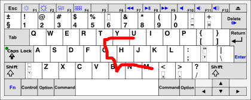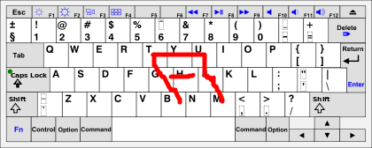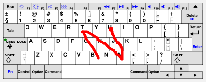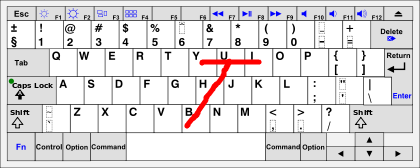

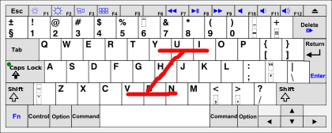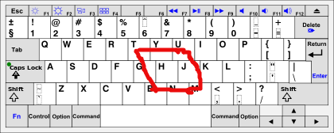

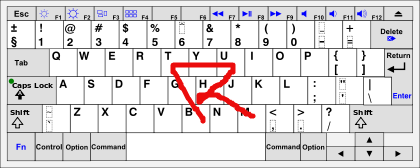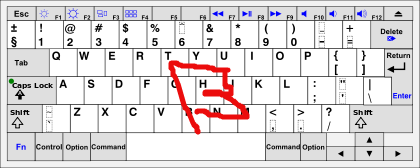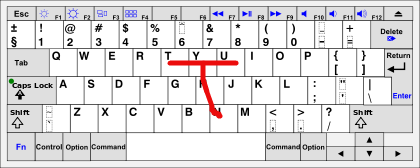

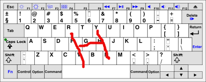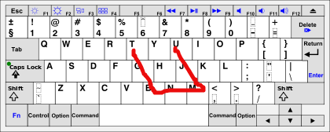

Flag: **fwhibbit{CANTFINDRABBITHUTCH}**

## AMOY

**Enunciado:** Oh god! You've ordered chinese food? I love chinese food! :D

**Archivos proporcionados:** [Amoy1](archivos/amoy/Amoy.jpg), [Amoy2](archivos/amoy/Amoy2.jpg)

**Puntos:** 375

**País:** Ethiopia

**Solución:**

Hay que bajarse el zip que contiene esas dos imágenes, se trata de un menu de un restaurante chino que ha sido modificado. En este caso, lo primero que hay que fijarse es en los números que se encuentran en la página principal del menú.

    02 08 05 05 14 15 15 22 07 21 14 06 14 19 05 22 18 01 17
    21 22 06 01 14 26 18 2206 21 08 05 25 18 12
    10 22 25 25 07 18 25 25 12 02 08 10 21 14 07 07 02 16 08 07
    05 18 26 02 09 18 14 25 06 02 03 05 22 26 18 06
    07 02 18 01 17 14 26 02 12 22 06 07 21 18 24 18 12

Se trata de números que se corresponden a una letra del abecedario, en este caso, del inglés, puesto que los retos estaban en inglés. Si convertimos el 01 en A, el 02 en B y así sucesivamente obtenemos lo siguiente.

    BHEENOOVGUNFNSEVRAQ
    UVFANZRVFUHEYRL
    JVYYGRYYLBHJUNGGBPHG
    ERZBIRNYFBCEVZRF

Podría parecer que este texto no tiene sentido y que el esfuerzo ha sido en vano, pero basta con pasar este texto por **rot13** para conseguir descifrarlo y obtener una pequeña pista.

	OURRABBITHASAFRIEND
	HISNAMEISHURLEY
	WILLTELLYOUWHATTOCUT
	REMOVEALSOPRIMES

La pista, en español, dice así, "nuestro conejo tiene un amigo, su nombre es Hurley, él te dirá que tienes que quitar. Quita también los primos". Esta pista, tenía que hacer pensar al jugador en que números del menu debía tachar! ¿Pero qué números tenía que tachar?

  - [ ] Todos los números primos del menú.
  - [ ] Los números del amigo Hurley. Buscando ["Hurley numbers"](http://lostpedia.wikia.com/wiki/The_Numbers) en google se obtienen los números malditos del personaje Hurley de la serie Lost. Esos números eran 4,8,15,16,23,42

  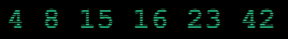

Quitando todos esos números del menú se obtenian los siguientes caracteres.

    40 61 6d 6f 79 63 68 69 6e 65 73 65 62 6f 74

Convirtiendo HEX a ASCII se obtiene el siguiente texto:

    "@amoychinesebot"

Se trata de un usuario de Telegram, aplicación de mensajería que se utilizó durante la competición. Si se buscaba el usuario se encontraba un BOT de Telegram. Que al iniciarlo, nos devolvía el siguiente mensaje:

    "Welcome to Amoy Chinese Food. We are having some troubles now and cant send orders at the 	moment. Please contact us for more information."

Había que ayudarle. Al pulsar sobre el botón del bot "What happened?" nos devolvía más información sobre el reto, donde por ejemplo, nos decía que la llave o key era AMOY:

    "We have been hacked and now the clients cant understand our menu. WE MUST DO SOMETHING. The only thing we know is that the key is our name, AMOY. Can you help us?"

*¿Pero para qué sería esa llave?*

De nuevo pidiendo ayuda, al pulsar sobre el menú del resturante, se obtenía el siguiente texto cifrado:

	  BZDX INH AFRC GBPZDE. JT GBGT BIVCDTR UNPQ PME JT CPAI VBAI SIR 	GZCOXST GD AF STDE. GWD NRHRBTT SP HCKPPZ SIR UKBT XR: 	XUDHTYTVJFRZSEDKM

Nada más ver el texto y pensar en la pista de la llave (AMOY) uno puede pensar en el cifrado Vigenere utilizando dicha clave. Y en efecto. Al descifrarlo usando, por ejemplo, [esta página](http://planetcalc.com/2468/) se obtiene el texto:

    "amoy has been hacked. we hate chinese food and we dont want the rabbits to be feed. the message to unlock the flag is: whoislewiscarroll"

Si de nuevo, volvemos al bot y escribimos al bot el mensaje que nos han dado "whoislewiscarroll" se obtiene un texto que contiene la flag.

    Lewis Carroll was the pen name of Charles L. Dodgson, author of the children's classics "Alice's Adventures in Wonderland" and "Through the Looking-Glass." Oh thanks! You have just resolved this challenge. The rabbits will eat lots of carrots tonight. The flag for this challenge is fwhibbit{meetrabbitatsix}

Por tanto, la flag del reto era: **fwhibbit{meetrabbitatsix}**

## ALL HAIL KING RAGNAR
