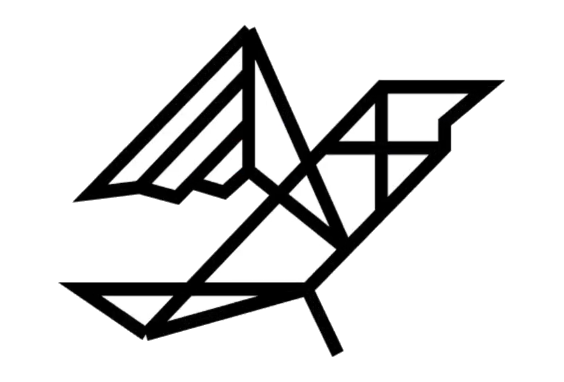

## ALL HAIL KING RAGNAR

**Enunciado:** What will his next move be. Ragnar knows the passphrase. It's one of his sons. Find his next move and write it in the correct format: fwhibbit{flag}

**Archivos proporcionados:** [conquer_paris.jpg](../archivos/kingragnar/conquer_paris.jpg)

**Puntos:** 250

**País:** Norway

**Solución:**

Lo primero era descargarse la imagen que se proporcionaba en un enlace. Se trata de una foto de Ragnar Lothbrok, un famoso vikingo. El primer paso para obtener la flag en este reto era ver si la imagen que se daba tenía algún archivo oculto. En este caso, al utilizar [steghide](http://steghide.sourceforge.net/) para tratar de obtener los ficheros ocultos nos pedía una passphrase, es decir, una contraseña.

Esta contraseña nos la proporcionaba, en parte, su enunciado. El enunciado dice que Ragnar conoce la contraseña, ésta, es uno de sus hijos. En wikipedia, se obtiene el mensaje:  "Ragnar toma como esposa a Aslaug (Kraka), también conocida como Randalin, hija de Sigurd y Brynhild y tuvieron cuatro hijos: Ivar, Björn, Hvitsärk y Sigurd Ragnarsson, llamado serpiente en el ojo por su iris, que se parecía a una serpiente rodeando la pupila."

Luego la contraseña sería uno de ellos. En este caso, lo ideal, era montar un diccionario personalizado utilizando por ejemplo una herramienta como [Your Own Wordlist](https://github.com/juanvelascogomez/YOW) introduciendo toda información sobre sus hijos. Nombres, apellidos, apodos... De esta manera tendríamos cubiertas todas las posibilidades acerca de ellos.

Puesto que el CTF estaba en inglés, la contraseña también lo estaría, en este caso:

    passphrase = ivartheboneless

Es decir, su hijo, Ivar el Deshuesado.

Y este era el resultado, había un archivo txt dentro de la imagen que se llamaba "evil_plan.txt", plan malvado del rey Ragnar.

    ᚹᛁᚲᛁᚾᚷᛊᛋ ᛁᛊᛋ ᚨ ᚼᛁᛊᛋᛏᛟᚱᛁᚲᚨᛚ ᛞᚱᚨᛗᚨ ᛏᛖᛚᛖᚹᛁᛊᛋᛁᛟᚾ ᛊᛋᛖᚱᛁᛖᛊᛋ ᚹᚱᛁᛏᛏᛖᚾ ᚨᚾᛞ ᚲᚱᛖᚨᛏᛖᛞ ᛒᛁ ᛗᛁᚲᚼᚨᛖᛚ ᚼᛁᚱᛊᛋᛏ ᚠᛟᚱ ᛏᚼᛖ ᚲᚼᚨᚾᚾᛖᛚ ᚼᛁᛊᛋᛏᛟᚱᛁ. ᚠᛁᛚᛗᛖᛞ ᛁᚾ ᛁᚱᛖᛚᚨᚾᛞ, ᛁᛏ ᛈᚱᛖᛗᛁᛖᚱᛖᛞ ᛟᚾ ᛗᚨᚱᚲᚼ ,  ᛁᚾ ᚲᚨᚾᚨᛞᚨ ᚨᚾᛞ ᛏᚼᛖ ᚢᚾᛁᛏᛖᛞ ᛊᛋᛏᚨᛏᛖᛊᛋ. ᚹᛁᚲᛁᚾᚷᛊᛋ ᛁᛊᛋ ᛁᚾᛊᛋᛈᛁᚱᛖᛞ ᛒᛁ ᛏᚼᛖ ᛊᛋᚨᚷᚨᛊᛋ ᛟᚠ ᚹᛁᚲᛁᚾᚷ ᚱᚨᚷᚾᚨᚱ ᛚᛟᛏᚼᛒᚱᛟᚲ, ᛟᚾᛖ ᛟᚠ ᛏᚼᛖ ᛒᛖᛊᛋᛏ ᚲᚾᛟᚹᚾ ᛚᛖᚷᛖᚾᛞᚨᚱᛁ ᚾᛟᚱᛊᛋᛖ ᚼᛖᚱᛟᛖᛊᛋ ᚨᚾᛞ ᚾᛟᛏᛟᚱᛁᛟᚢᛊᛋ ᚨᛊᛋ ᛏᚼᛖ ᛊᛋᚲᛟᚢᚱᚷᛖ ᛟᚠ ᛖᚾᚷᛚᚨᚾᛞ ᚨᚾᛞ ᚠᚱᚨᚾᚲᛖ. ᛏᚼᛖ ᛊᛋᚼᛟᚹ ᛈᛟᚱᛏᚱᚨᛁᛊᛋ ᚱᚨᚷᚾᚨᚱ ᚨᛊᛋ ᚨ ᚠᚨᚱᛗᛖᚱ ᚹᚼᛟ ᚱᛁᛊᛋᛖᛊᛋ ᛏᛟ ᚠᚨᛗᛖ ᛒᛁ ᛊᛋᚢᚲᚲᛖᛊᛋᛊᛋᚠᚢᛚ ᚱᚨᛁᛞᛊᛋ ᛁᚾᛏᛟ ᛖᚾᚷᛚᚨᚾᛞ, ᚨᚾᛞ ᛖᚹᛖᚾᛏᚢᚨᛚᛚᛁ ᛒᛖᚲᛟᛗᛖᛊᛋ ᚨ ᛊᛋᚲᚨᚾᛞᛁᚾᚨᚹᛁᚨᚾ ᚲᛁᚾᚷ, ᚹᛁᛏᚼ ᛏᚼᛖ ᛊᛋᚢᛈᛈᛟᚱᛏ ᛟᚠ ᚼᛁᛊᛋ ᚠᚨᛗᛁᛚᛁ ᚨᚾᛞ ᚠᛖᛚᛚᛟᚹ ᚹᚨᚱᚱᛁᛟᚱᛊᛋ ᚼᛁᛊᛋ ᛒᚱᛟᛏᚼᛖᚱ ᚱᛟᛚᛚᛟ, ᚼᛁᛊᛋ ᛊᛋᛟᚾ ᛒᛃᚱᚾ ᛁᚱᛟᚾᛊᛋᛁᛞᛖ, ᚨᚾᛞ ᚼᛁᛊᛋ ᚹᛁᚹᛖᛊᛋᛏᚼᛖ ᛊᛋᚼᛁᛖᛚᛞᛗᚨᛁᛞᛖᚾ ᛚᚨᚷᛖᚱᛏᚼᚨ ᚨᚾᛞ ᛏᚼᛖ ᛈᚱᛁᚾᚲᛖᛊᛋᛊᛋ ᚨᛊᛋᛚᚨᚢᚷ. ᚹᛁᚲᛁᚾᚷᛊᛋ ᚹᚨᛊᛋ ᚱᛖᚾᛖᚹᛖᛞ ᚠᛟᚱ ᚨ ᚠᛟᚢᚱᛏᚼ ᛊᛋᛖᚨᛊᛋᛟᚾ ᛁᚾ ᛗᚨᚱᚲᚼ  ᚹᛁᛏᚼ ᚨᚾ ᛖᛏᛖᚾᛞᛖᛞ ᛟᚱᛞᛖᚱ ᛟᚠ  ᛖᛈᛁᛊᛋᛟᛞᛖᛊᛋ, ᚹᚼᛁᚲᚼ ᛈᚱᛖᛗᛁᛖᚱᛖᛞ ᛟᚾ ᚠᛖᛒᚱᚢᚨᚱᛁ , . ᛟᚾ ᛗᚨᚱᚲᚼ , , ᚼᛁᛊᛋᛏᛟᚱᛁ ᚱᛖᚾᛖᚹᛖᛞ ᚹᛁᚲᛁᚾᚷᛊᛋ ᚠᛟᚱ ᚨ ᚠᛁᚠᛏᚼ ᛊᛋᛖᚨᛊᛋᛟᚾ ᛟᚠ  ᛖᛈᛁᛊᛋᛟᛞᛖᛊᛋ

    ᛏᚼᛖ ᛊᛋᛖᚱᛁᛖᛊᛋ ᛁᛊᛋ ᛁᚾᛊᛋᛈᛁᚱᛖᛞ ᛒᛁ ᛏᚼᛖ ᛏᚨᛚᛖᛊᛋ ᛟᚠ ᛏᚼᛖ ᚱᚨᛁᛞᛁᚾᚷ, ᛏᚱᚨᛞᛁᚾᚷ, ᚨᚾᛞ ᛖᛈᛚᛟᚱᛁᚾᚷ ᚾᛟᚱᛊᛋᛖᛗᛖᚾ ᛟᚠ ᛖᚨᚱᛚᛁ ᛗᛖᛞᛁᛖᚹᚨᛚ ᛊᛋᚲᚨᚾᛞᛁᚾᚨᚹᛁᚨ. ᛁᛏ ᚠᛟᛚᛚᛟᚹᛊᛋ ᛏᚼᛖ ᛖᛈᛚᛟᛁᛏᛊᛋ ᛟᚠ ᛏᚼᛖ ᛚᛖᚷᛖᚾᛞᚨᚱᛁ ᚹᛁᚲᛁᚾᚷ ᚲᚼᛁᛖᚠᛏᚨᛁᚾ ᚱᚨᚷᚾᚨᚱ ᛚᛟᛏᚼᛒᚱᛟᚲ ᚨᚾᛞ ᚼᛁᛊᛋ ᚲᚱᛖᚹ ᚨᚾᛞ ᚠᚨᛗᛁᛚᛁ, ᚨᛊᛋ ᚾᛟᛏᚨᛒᛚᛁ ᛚᚨᛁᛞ ᛞᛟᚹᚾ ᛁᚾ ᛏᚼᛖ ᛏᚼ ᚲᛖᚾᛏᚢᚱᛁ ᛊᛋᚨᚷᚨᛊᛋ ᚱᚨᚷᚾᚨᚱᛊᛋ ᛊᛋᚨᚷᚨ ᛚᛟᛒᚱᛟᚲᚨᚱ ᚨᚾᛞ ᚱᚨᚷᚾᚨᚱᛊᛋᛊᛋᛟᚾᚨ ᚦᚨᛏᛏᚱ, ᚨᛊᛋ ᚹᛖᛚᛚ ᚨᛊᛋ ᛁᚾ ᛊᛋᚨᛟ ᚷᚱᚨᛗᛗᚨᛏᛁᚲᚢᛊᛋᛊᛋ ᛏᚼ ᚲᛖᚾᛏᚢᚱᛁ ᚹᛟᚱᚲ ᚷᛖᛊᛋᛏᚨ ᛞᚨᚾᛟᚱᚢᛗ. ᚾᛟᚱᛊᛋᛖ ᛚᛖᚷᛖᚾᛞᚨᚱᛁ ᛊᛋᚨᚷᚨᛊᛋ ᚹᛖᚱᛖ ᛈᚨᚱᛏᛁᚨᛚᛚᛁ ᚠᛁᚲᛏᛁᛟᚾᚨᛚ ᛏᚨᛚᛖᛊᛋ ᛒᚨᛊᛋᛖᛞ ᛁᚾ ᚾᛟᚱᛊᛋᛖ ᛟᚱᚨᛚ ᛏᚱᚨᛞᛁᛏᛁᛟᚾ, ᚹᚱᛁᛏᛏᛖᚾ ᛞᛟᚹᚾ ᚨᛒᛟᚢᛏ  ᛏᛟ  ᛁᛖᚨᚱᛊᛋ ᚨᚠᛏᛖᚱ ᛏᚼᛖ ᛖᚹᛖᚾᛏᛊᛋ ᛏᚼᛖᛁ ᛞᛖᛊᛋᚲᚱᛁᛒᛖ. ᚠᚢᚱᛏᚼᛖᚱ ᛁᚾᛊᛋᛈᛁᚱᚨᛏᛁᛟᚾ ᛁᛊᛋ ᛏᚨᚲᛖᚾ ᚠᚱᛟᛗ ᚼᛁᛊᛋᛏᛟᚱᛁᚲᚨᛚ ᛊᛋᛟᚢᚱᚲᛖᛊᛋ ᛟᚠ ᛏᚼᛖ ᛈᛖᚱᛁᛟᛞ, ᛊᛋᚢᚲᚼ ᚨᛊᛋ ᚱᛖᚲᛟᚱᛞᛊᛋ ᛟᚠ ᛏᚼᛖ ᚹᛁᚲᛁᚾᚷ ᚱᚨᛁᛞ ᛟᚾ ᛚᛁᚾᛞᛁᛊᛋᚠᚨᚱᚾᛖ ᛞᛖᛈᛁᚲᛏᛖᛞ ᛁᚾ ᛏᚼᛖ ᛊᛋᛖᚲᛟᚾᛞ ᛖᛈᛁᛊᛋᛟᛞᛖ, ᛟᚱ ᚨᚼᛗᚨᛞ ᛁᛒᚾ ᚠᚨᛞᛚᚨᚾᛊᛋ ᛏᚼ ᚲᛖᚾᛏᚢᚱᛁ ᚨᚲᚲᛟᚢᚾᛏ ᛟᚠ ᛏᚼᛖ ᚹᛟᛚᚷᚨ ᚹᛁᚲᛁᚾᚷᛊᛋ. ᛏᚼᛖ ᛊᛋᛖᚱᛁᛖᛊᛋ ᛁᛊᛋ ᛊᛋᛖᛏ ᚨᛏ ᛏᚼᛖ ᛒᛖᚷᛁᚾᚾᛁᚾᚷ ᛟᚠ ᛏᚼᛖ ᚹᛁᚲᛁᚾᚷ ᚨᚷᛖ, ᛗᚨᚱᚲᛖᛞ ᛒᛁ ᛏᚼᛖ ᛚᛁᚾᛞᛁᛊᛋᚠᚨᚱᚾᛖ ᚱᚨᛁᛞ ᛁᚾ .

    ᚠᛚᚨᚷ ᛁᛊᛋ ᚱᛖᚨᚲᚼ_ᚹᚨᛚᚼᚨᛚᛚᚨ_ᛒᛖᚠᛟᚱᛖ_ᚼᛁᛊᛋ_ᛒᚱᛟᛏᚼᛖᚱ. ᚱᛖᛗᛒᛖᛗᛒᛖᚱ ᛏᛟ ᚹᚱᛁᛏᛖ ᛁᛏ ᚲᛟᚱᚱᛖᚲᛏᛚᛁ ᚱᚨᚷᚾᚨᚱ ᛚᛟᛏᚼᛒᚱᛟᚲ ᛁᛊᛋ ᚨ ᛗᛁᚷᚼᛏᛁ ᚨᚾᛞ ᛚᛖᚷᛖᚾᛞᚨᚱᛁ ᚹᛁᚲᛁᚾᚷ ᚼᛖᚱᛟ, ᚹᚨᚱᚱᛁᛟᚱ, ᛖᛈᛚᛟᚱᛖᚱ, ᚲᛁᚾᚷ ᛟᚠ ᛞᛖᚾᛗᚨᚱᚲ, ᚨᚾᛞ ᚠᛟᚢᚾᛞᛖᚱ ᛟᚠ ᚼᛟᚢᛊᛋᛖ ᛟᚠ ᛚᛟᛏᚼᛒᚱᛟᚲ, ᚹᚼᛟ ᛒᛖᛚᛁᛖᚹᛖᛊᛋ ᛒᛖᛁᚾᚷ ᛞᛖᛊᛋᛏᛁᚾᛖᛞ ᚠᛟᚱ ᚷᚱᛖᚨᛏᚾᛖᛊᛋᛊᛋ. ᚼᛖ ᛁᛊᛋ ᛞᚱᛁᚹᛖᚾ ᚾᛟᛏ ᛟᚾᛚᛁ ᛒᛁ ᚼᛁᛊᛋ ᛏᚼᛁᚱᛊᛋᛏ ᚠᛟᚱ ᛒᚨᛏᛏᛚᛖ ᚨᚾᛞ ᚷᛚᛟᚱᛁ, ᛒᚢᛏ ᚨᛚᛊᛋᛟ ᛒᛁ ᚼᛁᛊᛋ ᛏᚼᛁᚱᛊᛋᛏ ᚠᛟᚱ ᚲᚾᛟᚹᛚᛖᛞᚷᛖ ᚨᚾᛞ ᛁᚾᚢᛁᛊᛋᛁᛏᛁᚹᛖ ᚾᚨᛏᚢᚱᛖ. ᛟᚾᚲᛖ ᛗᛖᚱᛖᛚᛁ ᚨ ᚠᚨᚱᛗᛖᚱ ᚨᚾᛞ ᚨ ᚠᚱᛖᚢᛖᚾᛏ ᛗᛖᛗᛒᛖᚱ ᛟᚠ ᛏᚼᛖ ᛊᛋᛖᚨ ᚱᚨᛁᛞᛖᚱᛊᛋ ᚨᛚᛟᚾᚷ ᚹᛁᛏᚼ ᚼᛁᛊᛋ ᚠᛖᛚᛚᛟᚹ ᚾᛟᚱᛊᛋᛖᛗᛖᚾ, ᚱᚨᚷᚾᚨᚱ ᚼᚨᛊᛋ ᛊᛋᛁᚾᚲᛖ ᚱᛁᛊᛋᛖᚾ ᛏᛟ ᛈᛟᚹᛖᚱ, ᛒᛖᚷᛁᚾᚾᛁᚾᚷ ᚹᛁᛏᚼ ᚼᛁᛊᛋ ᛊᛋᚢᚲᚲᛖᛊᛋᛊᛋᚠᚢᛚ ᚨᚾᛞ ᛁᚾᚠᚨᛗᛟᚢᛊᛋ ᚱᚨᛁᛞᛊᛋ ᛟᚠ ᛏᚼᛖ ᚹᛖᛊᛋᛏ, ᛚᚨᛏᛖᚱ ᛒᛖᚲᚨᛗᛖ ᛏᚼᛖ ᛖᚨᚱᛚ ᛟᚠ ᚲᚨᛏᛏᛖᚷᚨᛏ ᚨᚾᛞ ᛖᚹᛖᚾᛏᚢᚨᛚᛚᛁ ᛖᚹᛖᚾ ᚲᛁᚾᚷ ᛟᚠ ᛞᛖᚾᛗᚨᚱᚲ. ᚱᚨᚷᚾᚨᚱᛊᛋ ᚨᛞᚹᛖᚾᛏᚢᚱᛁᚾᚷ ᛊᛋᛈᛁᚱᛁᛏ ᛒᚱᛁᚾᚷᛊᛋ ᚼᛁᛗ ᛁᚾᛏᛟ ᚲᛟᚾᚠᛚᛁᚲᛏ ᚹᛁᛏᚼ ᛈᛟᚹᛖᚱᚠᚢᛚ ᛗᛖᚾ ᚹᚼᛟ ᛏᚱᛁ ᛏᛟ ᛒᛚᛟᚲᚲ ᚼᛁᛊᛋ ᚨᛊᛋᚲᛖᚾᛏ, ᚠᚱᛟᛗ ᚠᚨᚱᛗᛖᚱ ᛏᛟ ᛚᛖᚨᛞᛖᚱᛏᛟ ᚢᚾᛏᛟᛚᛞ ᚼᛖᛁᚷᚼᛏᛊᛋ. ᚱᚨᚷᚾᚨᚱ ᛁᛞᛖᚾᛏᛁᚠᛁᛖᛊᛋ ᚹᛁᛏᚼ ᛏᚼᛖ ᚷᛟᛞ ᛟᛞᛁᚾ, ᚹᚼᛟ ᛏᚱᚨᛞᛖᛞ ᚼᛁᛊᛋ ᛖᛁᛖ ᚠᛟᚱ ᚲᚾᛟᚹᛚᛖᛞᚷᛖ, ᚨᚾᛞ ᛒᛖᛚᛁᛖᚹᛖᛊᛋ ᚼᛁᛗᛊᛋᛖᛚᚠ ᛏᛟ ᛒᛖ ᛞᛖᛊᛋᚲᛖᚾᛞᛖᛞ ᚠᚱᛟᛗ ᚼᛁᛗ.

    ᚢᛖᛖᚾ ᛚᚨᚷᛖᚱᛏᚼᚨ ᛁᛊᛋ ᚨ ᚹᛖᛚᛚ ᚲᚾᛟᚹᚾ ᛊᛋᚼᛁᛖᛚᛞ ᛗᚨᛁᛞᛖᚾ ᚨᚾᛞ ᚢᛖᛖᚾ ᚱᛖᚷᚾᚨᚾᛏ ᛟᚠ ᛞᛖᚾᛗᚨᚱᚲ. ᛊᛋᚼᛖ ᚲᛟᚾᛏᛁᚾᚢᛖᛊᛋ ᛏᛟ ᚠᛁᚷᚼᛏ ᚨᛚᛟᚾᚷᛊᛋᛁᛞᛖ ᚼᛖᚱ ᚠᛟᚱᛗᛖᚱ ᚼᚢᛊᛋᛒᚨᚾᛞ, ᚱᚨᚷᚾᚨᚱ, ᚹᚼᛟᛗ ᛊᛋᚼᛖ ᛁᛊᛋ ᛊᛋᛏᛁᛚᛚ ᛁᚾ ᛚᛟᚹᛖ ᚹᛁᛏᚼ,  ᚼᛖᚱ ᚠᛖᛚᛚᛟᚹ ᚹᛁᚲᛁᚾᚷ ᚠᛁᚷᚼᛏᛖᚱᛊᛋ. ᛊᛋᛁᚾᚲᛖ ᛏᚼᛖ ᛚᛟᛊᛋᛊᛋ ᛟᚠ ᚼᛖᚱ ᚲᚼᛁᛚᛞᚱᛖᚾ ᚨᚾᛞ ᛊᛋᚢᚠᚠᛖᚱᛁᚾᚷ ᛏᚼᛖ ᛒᛚᛟᚹᛊᛋ ᛟᚠ ᛚᛟᚹᛖ ᚨᚾᛞ ᚱᛖᛃᛖᚲᛏᛁᛟᚾ, ᛚᚨᚷᛖᚱᛏᚼᚨ ᚱᛖᚨᛚᛁᛉᛖᛊᛋ ᛏᚼᚨᛏ ᚠᚱᛖᛁᛃᚨᛊᛋ ᚠᛖᚱᛏᛁᛚᛁᛏᛁ ᛁᛊᛋ ᛗᛖᚨᚾᛏ ᚠᛟᚱ ᚨᚾᛟᛏᚼᛖᚱ, ᚨᚾᛞ ᛏᚼᚨᛏ ᛁᛏ ᛁᛊᛋ ᛏᚼᛖ ᚷᛟᛞᛞᛖᛊᛋᛊᛋ ᚹᚨᚱᚱᛁᛟᚱ ᚨᛊᛋᛈᛖᚲᛏ ᛏᚼᚨᛏ ᛊᛋᛈᛖᚨᚲᛊᛋ ᛏᛟ ᚼᛖᚱ ᚠᛖᛚᛚᛟᚹ ᚹᚨᛚᚲᛁᚱᛁᛖ. ᛚᚨᚷᛖᚱᛏᚼᚨ ᚱᛖᛗᚨᛁᚾᛊᛋ ᚠᛁᛖᚱᚲᛖᛚᛁ ᛁᚾᛞᛖᛈᛖᚾᛞᛖᚾᛏ ᚹᚼᛖᚾ ᛁᛏ ᚲᛟᛗᛖᛊᛋ ᛏᛟ ᛈᚱᛟᛏᛖᚲᛏᛁᚾᚷ ᚼᛖᚱ ᚠᚨᛗᛁᛚᛁᚨᚾᛞ ᛏᚼᛖ ᛏᚼᚱᛟᚾᛖ.

Dicho archivo, lo teneis disponible para descargar [evil_plan.txt](../archivos/kingragnar/evil_plan.txt)

Este texto, como bien se puede comprobar con una primera vista, no esta en español, sino que está en un idioma vikingo. Dicho idioma vikingo no es más que [futhark antiguo](https://es.wikipedia.org/wiki/Futhark_antiguo). En internet se pueden encontrar muchas imágenes y páginas web donde indagan un poco más en este lenguaje y en su traducción con respecto a las letras de nuestro abecedario.

Había que traducir el texto que nos habíamos encontrado. ¿Qué tal vamos de python?

Este es el script en python que he desarrollado para resolver el reto y para pasar un buen rato traduciendo textos.

[FuthrakWhat](https://github.com/juanvelascogomez/futharkwhat)

Una vez que le pasamos el fichero [evil_plan.txt](../archivos/kingragnar/evil_plan.txt) al programa nos devuelve el texto traducido:

    vicings is a historical drama television series vritten and created bi michael hirst for the channel histori. filmed in ireland, it premiered on march ,  in canada and the united states. vicings is inspired bi the sagas of vicing ragnar lothbroc, one of the best cnovn legendari norse heroes and notorious as the scourge of england and france. the shov portrais ragnar as a farmer vho rises to fame bi successful raids into england, and eventualli becomes a scandinavian cing, vith the support of his famili and fellov varriors his brother rollo, his son bjrn ironside, and his vivesthe shieldmaiden lagertha and the princess aslaug. vicings vas reneved for a fourth season in march  vith an etended order of  episodes, vhich premiered on februari , . on march , , histori reneved vicings for a fifth season of  episodes

    the series is inspired bi the tales of the raiding, trading, and eploring norsemen of earli medieval scandinavia. it follovs the eploits of the legendari vicing chieftain ragnar lothbroc and his crev and famili, as notabli laid dovn in the th centuri sagas ragnars saga lobrocar and ragnarssona þattr, as vell as in sao grammaticuss th centuri vorc gesta danorum. norse legendari sagas vere partialli fictional tales based in norse oral tradition, vritten dovn about  to  iears after the events thei describe. further inspiration is tacen from historical sources of the period, such as records of the vicing raid on lindisfarne depicted in the second episode, or ahmad ibn fadlans th centuri account of the volga vicings. the series is set at the beginning of the vicing age, marced bi the lindisfarne raid in .

    flag is reach_valhalla_before_his_brother. rembember to vrite it correctli ragnar lothbroc is a mighti and legendari vicing hero, varrior, eplorer, cing of denmarc, and founder of house of lothbroc, vho believes being destined for greatness. he is driven not onli bi his thirst for battle and glori, but also bi his thirst for cnovledge and inuisitive nature. once mereli a farmer and a freuent member of the sea raiders along vith his fellov norsemen, ragnar has since risen to pover, beginning vith his successful and infamous raids of the vest, later became the earl of cattegat and eventualli even cing of denmarc. ragnars adventuring spirit brings him into conflict vith poverful men vho tri to blocc his ascent, from farmer to leaderto untold heights. ragnar identifies vith the god odin, vho traded his eie for cnovledge, and believes himself to be descended from him.

    ueen lagertha is a vell cnovn shield maiden and ueen regnant of denmarc. she continues to fight alongside her former husband, ragnar, vhom she is still in love vith,  her fellov vicing fighters. since the loss of her children and suffering the blovs of love and rejection, lagertha realizes that freijas fertiliti is meant for another, and that it is the goddess varrior aspect that speacs to her fellov valcirie. lagertha remains fierceli independent vhen it comes to protecting her familiand the throne.

Donde se puede encontrar la flag es reach_valhalla_before_his_brother.

Por tanto:

Flag: **fwhibbit{reach_valhalla_before_his_brother}**
